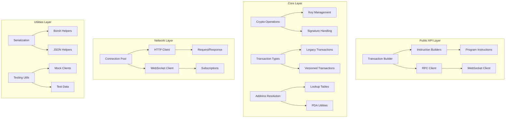

# Design Document

## Overview

This design document outlines the architecture and implementation approach for enhancing the Solana Primitives library. The enhancements will transform it from a basic transaction building library into a comprehensive Solana development toolkit while maintaining backward compatibility and following Rust best practices.

The design focuses on modularity, extensibility, and developer experience while ensuring high performance and reliability for production use cases.

## Architecture

### High-Level Architecture



### Module Structure

The enhanced library will be organized into the following modules:

```
solana-primitives/
├── src/
│   ├── lib.rs                    # Main library exports
│   ├── builder/                  # Transaction and instruction builders
│   │   ├── mod.rs
│   │   ├── transaction.rs        # Enhanced transaction builder
│   │   ├── instruction.rs        # Enhanced instruction builder
│   │   └── versioned.rs          # Versioned transaction support
│   ├── crypto/                   # Cryptographic operations
│   │   ├── mod.rs
│   │   ├── keypair.rs           # Keypair generation and management
│   │   ├── signature.rs         # Signature operations
│   │   └── pda.rs               # Program Derived Address utilities
│   ├── instructions/             # Program-specific instructions
│   │   ├── mod.rs
│   │   ├── system.rs            # System program (enhanced)
│   │   ├── token.rs             # SPL Token (enhanced)
│   │   ├── token_2022.rs        # SPL Token 2022 (new)
│   │   ├── stake.rs             # Stake program (new)
│   │   ├── vote.rs              # Vote program (new)
│   │   ├── address_lookup.rs    # Address lookup tables (new)
│   │   └── compute_budget.rs    # Compute budget (enhanced)
│   ├── rpc/                     # RPC client functionality
│   │   ├── mod.rs
│   │   ├── client.rs            # HTTP RPC client (enhanced)
│   │   ├── websocket.rs         # WebSocket client (new)
│   │   ├── methods/             # RPC method implementations
│   │   │   ├── mod.rs
│   │   │   ├── account.rs       # Account-related methods
│   │   │   ├── transaction.rs   # Transaction-related methods
│   │   │   └── program.rs       # Program-related methods
│   │   └── types/               # RPC-specific types
│   ├── types/                   # Core data types (enhanced)
│   ├── utils/                   # Utility functions
│   │   ├── mod.rs
│   │   ├── serialization.rs    # Enhanced serialization helpers
│   │   ├── validation.rs       # Transaction validation
│   │   └── debugging.rs        # Debugging utilities
│   └── testing/                 # Testing utilities (new)
│       ├── mod.rs
│       ├── mock_client.rs       # Mock RPC client
│       └── test_data.rs         # Test data generators
```

## Components and Interfaces

### Enhanced Transaction Builder

The transaction builder will be enhanced to support versioned transactions and automatic optimization:

```rust
pub struct TransactionBuilder {
    fee_payer: Pubkey,
    instructions: Vec<Instruction>,
    recent_blockhash: Option<[u8; 32]>,
    version: TransactionVersion,
    lookup_tables: Vec<AddressLookupTable>,
    compute_budget: Option<ComputeBudgetConfig>,
}

impl TransactionBuilder {
    pub fn new_versioned(fee_payer: Pubkey, version: TransactionVersion) -> Self;
    pub fn with_lookup_table(mut self, table: AddressLookupTable) -> Self;
    pub fn with_compute_budget(mut self, config: ComputeBudgetConfig) -> Self;
    pub fn auto_optimize(mut self) -> Self; // Automatically use lookup tables when beneficial
    pub fn build_versioned(self) -> Result<VersionedTransaction>;
}
```

### Comprehensive Instruction Builders

Each program will have its own instruction builder with type-safe methods:

```rust
pub struct TokenInstructionBuilder;

impl TokenInstructionBuilder {
    pub fn transfer_checked(
        source: &Pubkey,
        mint: &Pubkey,
        destination: &Pubkey,
        authority: &Pubkey,
        amount: u64,
        decimals: u8,
    ) -> Instruction;
    
    pub fn create_associated_token_account(
        payer: &Pubkey,
        wallet: &Pubkey,
        mint: &Pubkey,
    ) -> Instruction;
}

pub struct StakeInstructionBuilder;

impl StakeInstructionBuilder {
    pub fn create_stake_account(
        from: &Pubkey,
        stake: &Pubkey,
        authorized: &Authorized,
        lockup: &Lockup,
        lamports: u64,
    ) -> Vec<Instruction>;
    
    pub fn delegate_stake(
        stake: &Pubkey,
        authorized: &Pubkey,
        vote: &Pubkey,
    ) -> Instruction;
}
```

### Enhanced RPC Client

The RPC client will be significantly expanded with comprehensive method support:

```rust
pub struct RpcClient {
    http_client: HttpClient,
    websocket_client: Option<WebSocketClient>,
    config: RpcConfig,
}

impl RpcClient {
    pub async fn get_account_info_with_config(
        &self,
        pubkey: &Pubkey,
        config: RpcAccountInfoConfig,
    ) -> RpcResult<Option<Account>>;
    
    pub async fn get_program_accounts_with_config(
        &self,
        program_id: &Pubkey,
        config: RpcProgramAccountsConfig,
    ) -> RpcResult<Vec<RpcKeyedAccount>>;
    
    pub async fn simulate_transaction(
        &self,
        transaction: &VersionedTransaction,
        config: RpcSimulateTransactionConfig,
    ) -> RpcResult<RpcSimulateTransactionResult>;
    
    pub async fn subscribe_account(
        &self,
        pubkey: &Pubkey,
        config: RpcAccountInfoConfig,
    ) -> RpcResult<AccountSubscription>;
}
```

### Cryptographic Operations

Enhanced crypto module with comprehensive key management:

```rust
pub struct Keypair {
    secret_key: ed25519_dalek::SecretKey,
    public_key: Pubkey,
}

impl Keypair {
    pub fn generate() -> Self;
    pub fn from_seed(seed: &[u8]) -> Result<Self>;
    pub fn from_base58_string(s: &str) -> Result<Self>;
    pub fn sign_message(&self, message: &[u8]) -> Signature;
    pub fn sign_transaction(&self, transaction: &mut Transaction) -> Result<()>;
}

pub struct PdaFinder;

impl PdaFinder {
    pub fn find_program_address(seeds: &[&[u8]], program_id: &Pubkey) -> (Pubkey, u8);
    pub fn create_program_address(seeds: &[&[u8]], program_id: &Pubkey) -> Result<Pubkey>;
    pub fn find_associated_token_address(wallet: &Pubkey, mint: &Pubkey) -> Pubkey;
}
```

## Data Models

### Enhanced Transaction Types

```rust
#[derive(Debug, Clone, Serialize, Deserialize)]
pub enum TransactionVersion {
    Legacy,
    V0,
}

#[derive(Debug, Clone, Serialize, Deserialize)]
pub struct ComputeBudgetConfig {
    pub compute_unit_limit: Option<u32>,
    pub compute_unit_price: Option<u64>,
    pub heap_frame_size: Option<u32>,
}

#[derive(Debug, Clone, Serialize, Deserialize)]
pub struct AddressLookupTable {
    pub key: Pubkey,
    pub addresses: Vec<Pubkey>,
}
```

### RPC Response Types

```rust
#[derive(Debug, Clone, Serialize, Deserialize)]
pub struct Account {
    pub lamports: u64,
    pub data: Vec<u8>,
    pub owner: Pubkey,
    pub executable: bool,
    pub rent_epoch: u64,
}

#[derive(Debug, Clone, Serialize, Deserialize)]
pub struct RpcKeyedAccount {
    pub pubkey: Pubkey,
    pub account: Account,
}

#[derive(Debug, Clone, Serialize, Deserialize)]
pub struct RpcSimulateTransactionResult {
    pub err: Option<TransactionError>,
    pub logs: Option<Vec<String>>,
    pub accounts: Option<Vec<Option<Account>>>,
    pub units_consumed: Option<u64>,
    pub return_data: Option<RpcTransactionReturnData>,
}
```

## Error Handling

Comprehensive error handling with specific error types:

```rust
#[derive(Debug, thiserror::Error)]
pub enum SolanaError {
    #[error("RPC error: {0}")]
    Rpc(#[from] RpcError),
    
    #[error("Transaction error: {0}")]
    Transaction(#[from] TransactionError),
    
    #[error("Serialization error: {0}")]
    Serialization(String),
    
    #[error("Cryptographic error: {0}")]
    Crypto(String),
    
    #[error("Network error: {0}")]
    Network(#[from] reqwest::Error),
    
    #[error("WebSocket error: {0}")]
    WebSocket(String),
}

#[derive(Debug, thiserror::Error)]
pub enum RpcError {
    #[error("Invalid params: {0}")]
    InvalidParams(String),
    
    #[error("Method not found: {0}")]
    MethodNotFound(String),
    
    #[error("Rate limited")]
    RateLimited,
    
    #[error("Node unhealthy")]
    NodeUnhealthy,
}
```

## Testing Strategy

### Unit Testing
- Comprehensive unit tests for all modules
- Property-based testing for cryptographic operations
- Mock RPC client for testing without network dependencies

### Integration Testing
- End-to-end transaction building and submission tests
- RPC client integration tests with real Solana nodes
- WebSocket subscription testing

### Performance Testing
- Benchmarks for transaction building and serialization
- RPC client performance tests
- Memory usage profiling

### Test Utilities

```rust
pub struct MockRpcClient {
    responses: HashMap<String, serde_json::Value>,
}

impl MockRpcClient {
    pub fn new() -> Self;
    pub fn add_response(&mut self, method: &str, response: serde_json::Value);
    pub fn expect_call(&mut self, method: &str, params: serde_json::Value);
}

pub struct TestDataGenerator;

impl TestDataGenerator {
    pub fn random_keypair() -> Keypair;
    pub fn random_pubkey() -> Pubkey;
    pub fn sample_transaction() -> Transaction;
    pub fn sample_account_data(size: usize) -> Vec<u8>;
}
```

## Implementation Phases

### Phase 1: Core Enhancements
- Enhanced transaction builder with versioned transaction support
- Comprehensive cryptographic operations
- Improved error handling

### Phase 2: Instruction Expansion
- SPL Token 2022 instructions
- Stake program instructions
- Vote program instructions
- Address lookup table instructions

### Phase 3: RPC Client Enhancement
- Complete RPC method coverage
- WebSocket client implementation
- Connection pooling and retry logic

### Phase 4: Developer Experience
- Comprehensive documentation
- Testing utilities
- Debugging tools
- Performance optimizations

## Backward Compatibility

All existing APIs will remain functional with deprecation warnings where appropriate. New functionality will be additive, and breaking changes will be introduced only in major version releases with clear migration paths.

## Performance Considerations

- Lazy initialization of expensive resources
- Connection pooling for RPC clients
- Efficient serialization with zero-copy where possible
- Async/await throughout for non-blocking operations
- Memory-efficient handling of large datasets with streaming support